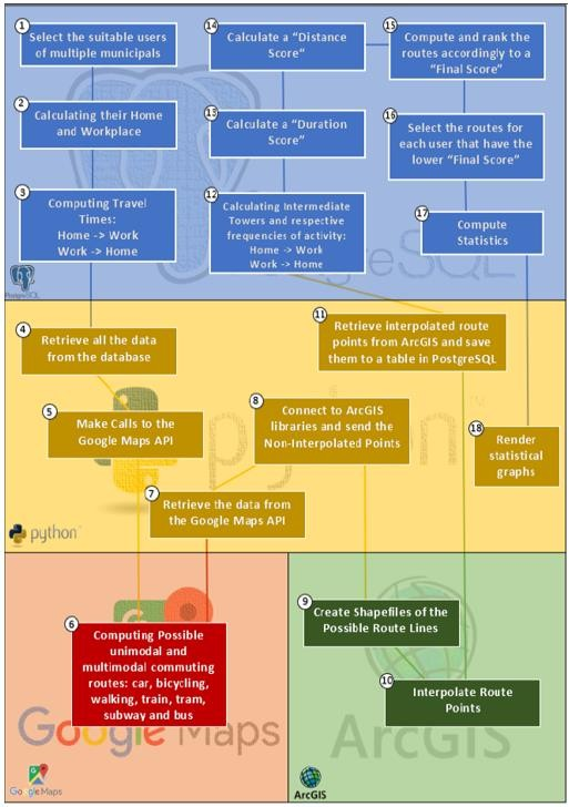

# PREDICTING COMMUTING ROUTES AND RESPECTIVES MODES OF TRANSPORT THROUGH CALL DETAIL RECORDS

  <b>More detailed information about the implementation and methodology used can be found in these series of articles:</b> 
  <a href="https://medium.com/@joelpires/inferring-commuting-routes-and-transportation-modes-from-call-detail-records-part-1-e01b91a66d92">Part 1</a> |
  <a href="https://medium.com/@joelpires/inferring-commuting-routes-and-transportation-modes-from-call-detail-records-part-2-f8af68b6ec3c">Part 2</a> |
  <a href="https://medium.com/@joelpires/inferring-commuting-routes-and-transportation-modes-from-call-detail-records-part-3-5f7bce92833a">Part 3</a>
    

  <b>Papers mentioned can be seen in detail here:</b> 
  <a href="https://onedrive.live.com/?authkey=%21AJbFCjWiSUZAiZY&cid=7AA0268291F2819E&id=7AA0268291F2819E%2199376&parId=root&o=OneUp">1st Paper</a> |
  <a href="https://link.springer.com/chapter/10.1007/978-3-030-30241-2_54">2nd Paper</a>
    

#### The project in question aims to:
  - ___Replicate paper results for the EPIA 2019, namely:___
    - Produce graphs and statistics to analyze the impact that the variation of some quality parameters of a CDR dataset has in the percentage of users from which we can infer commuting patterns.
    - These quality parameters or features involve: towers density per square kilometer; number of different day of call activity; average number of calls the user makes/receives per day; regularity with which users make/receive calls.

- ___Replicate paper results for the TRA2020, namely:___
    - Produce Shapefiles and statistics showing the probability distribution of different modes of transport used in commuting routes within the city.
    - These modes include: car, bus, metro, train, subway, walking and cycling.
    - percentages are still produced on a single-mode solutions, multimodal, private and public adopted by users during their commuting routes.
    - These results require further validation; as well as shapefiles in need of a projection on a map with the help of ArcGIS or QGIS.
    - In this case, it was used CDRs from PTelecom/Altice Labs dated from 2007. So the results were validated by comparing the results obtained with IMTT censuses, namely:
      - [1st Census](http://www.imt-ip.pt/sites/IMTT/Portugues/Observatorio/Relatorios/MobilidadeCidadesMedias/Documents/IMT_Mobilidade_em_Cidades_Medias_vrevista_atualizada.pdf)

      - [2nd Census](http://www.imt-ip.pt/sites/IMTT/Portugues/Observatorio/Relatorios/MobilidadeCidadesMedias/Documents/IMTT_Mobilidade_em_Cidades_Medias_2011.pdf)

#### Practically all code functions are commented in the code itself.

#### Prerequisites for running the program:
  - **ArcGIS** installed
  - **Python** installed (and PyCharm preferably)
  - **PostgreSQL** installed (DataGrip and preferably)
  - Account Google Cloud Platforms with key access to the **Directions API**.

#### Dataset used belongs to Orange/Altice Labs and it's classified. The dataset was manipulated remotely through a Database that belongs to CISUC Laboratories.

#### Files and order of execution:

- **0.  &quot;Database.ini&quot; -** file which sets the database information so that the python can access the data in it.

- **0. log.txt -** file that the program &quot;4\_altice\_getPossibleRoutes.py&quot; creates and uses to write relevant information during the extraction of possible commuting routes of each user through the google api.

- **0. shapefiles in the C: \ Users \ \<your user\> \ Documents \ altice\_ODPaths -** these shapefiles are created during the execution of the &quot;4\_altice\_getPossibleRoutes.py&quot; and correspond to the possible commuting routes for each user. They can later be shown in ArcGIS or QGIS for its correct display.

- **1. &quot;1\_altice\_cleaning.sql&quot; -** This is the first file to run and probably the most time consuming. It is responsible for cleaning / process data - it eliminates null values, negative data other nonsense data.

- **2. &quot;1a) altice\_oscillations\_cases.sql&quot; -** _File to optionally run._ _Only gives information on cases that may occur phenomena oscillatory calls and having to remove._

- **3. &quot;2\_altice\_user\_characterization.sql&quot; -** _File responsible for creating tables that feature all users of the entire dataset. This characterization involves describing, for example: how many calls they made on average, how many days of different call activity, among other metrics and features extracted._

- **4. &quot;2a) altice\_paper1\_insights.sql&quot; -** _File to run optionally._ _It's necessary to create the tables for later statistical and graphical analysis performed by_ &quot;2b) altice\_stats\_paper1.py&quot; _file_.

- **5. &quot;2b) altice\_stats\_paper1.py&quot; -** _File to run only optionally._ It produces statistical and graphical analysis. It allows you to analyze how the variation of some quality parameters of a CDR dataset impacts the percentage of users from which we can infer commuting patterns.

- **6. &quot;3\_altice\_subsampling.sql&quot; -** _File responsible for subsampling the dataset, so that the inference of commuting routes and modes of transport is faster and more efficient. To make an optimized sub-sampling, it is advised to examine the elements generated by &quot;2b) altice\_stats\_paper1.py&quot; and choose the best criteria in accordance with the conclusions obtained. (**Steps 1, 2 and 3 of Figure 1**)_

- **7. &quot;4\_altice\_getPossibleRoutes.py&quot; -** _File responsible for making calls to the Google API to collect possible commuting routes for each user as well as to send back such points to tables in PostgreSQL. Shapefiles with these route points are generated. (**Steps 4-11 of Figure 1**)_

- **8. &quot;5\_altice\_paper2\_final\_routes.sql&quot; -** _Analyzes the possible routes provided by the Google Maps API and, according scoring formulas, assigns a score to each route and chooses the most likely route for each user in your home->workplace route and another route on his way from workplace->home. (**Steps 12-17 of Figure 1**)_

- **9. &quot;5a) altice\_stats\_paper2.py&quot; -** _File to run optionally. Being the most probable routes and respective means of transport associated with them determined, statistics on transport distribution can be calculated. Percentages relative single-mode solutions, multimodal solutions, private and public modes adopted by users during their commuting routes are also produced. (**Step 18 of Figure 1**)_

  
   <b>Figure 1 - General Program Structure</b> 

